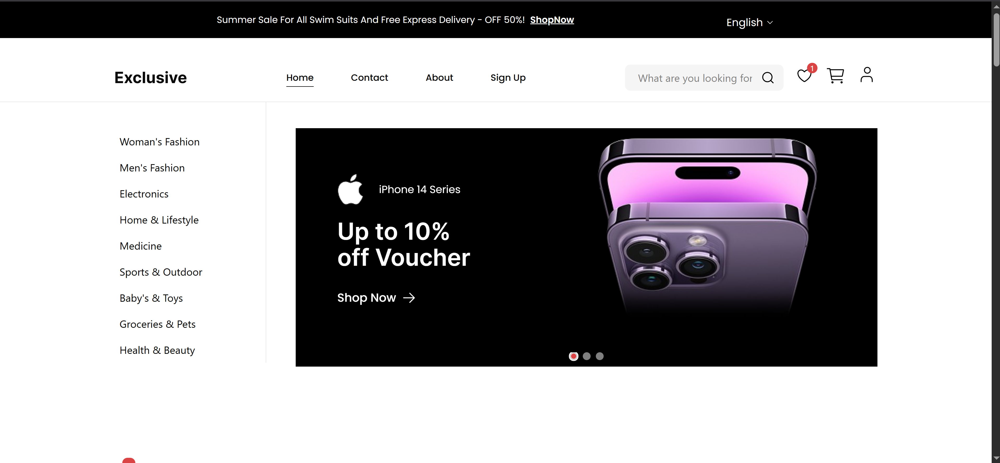

# 🛍️ E-Commerce Web Application

A modern, fully responsive E-Commerce web application built with React, Firebase, and TailwindCSS.  
Users can browse products, manage cart & wishlist, place orders, and manage their account securely.

---

## 📸 Preview  


---

---

## 🚀 Live Demo

🔗 https://exclusive-cs196bgpl-karem-abdelkarems-projects.vercel.app/

---

## ✨ Features

- 🔐 Authentication (Register / Login / Logout)
- 🛒 Add to Cart (Persistent per user)
- ❤️ Wishlist (Persistent per user)
- 👓 Product search
- 📦 Place Orders
- 📜 Order History
- 👤 User Account Management
- 🌍 Multi-language Support (i18n)
- 📱 Fully Responsive Design
- 🔒 Secure Firestore Rules

---

## 🧰 Tech Stack

### Frontend
- React (Vite)
- React Router
- Context API
- TailwindCSS
- shadcn/ui (Radix UI)
- i18next
- React hook form
- React hot toast

### Backend / Database
- Firebase Authentication
- Cloud Firestore

### Deployment
- Vercel

---

## 📁 Project Structure

```
src/
 ├── components/
 ├── pages/
 ├── context/
 ├── firebase/
 ├── hooks/
 └── assets/
```

---

## 🔐 Firestore Structure

### Collections

- `users/{uid}`
- `cart/{uid}`
- `wishlist/{uid}`
- `orders/{autoId}`


```

---

## ⚙️ Environment Variables

Create a `.env` file in the root:

```env
VITE_FIREBASE_API_KEY=
VITE_FIREBASE_AUTH_DOMAIN=
VITE_FIREBASE_PROJECT_ID=
VITE_FIREBASE_STORAGE_BUCKET=
VITE_FIREBASE_MESSAGING_SENDER_ID=
VITE_FIREBASE_APP_ID=
```

For production (Vercel), add the same variables in:

Project → Settings → Environment Variables

---

## 🛠️ Installation & Setup

### 1️⃣ Clone the repository

```bash
git clone https://github.com/your-username/your-repo.git
cd your-repo
```

### 2️⃣ Install dependencies

```bash
npm install
```

### 3️⃣ Run development server

```bash
npm run dev
```

### 4️⃣ Build for production

```bash
npm run build
```

---

## 🔄 React Router (Vercel Fix)

Create a `vercel.json` file in root:

```json
{
  "rewrites": [
    { "source": "/(.*)", "destination": "/" }
  ]
}
```

---

## 🔒 Security

- Users can only access their own cart, wishlist, and orders.
- Orders cannot be modified after creation.
- Firestore rules enforce user ownership via `request.auth.uid`.

---

## 📌 Future Improvements

- Admin dashboard
- Product management panel
- Stripe payment integration
- Order status updates
- Product search & filters

---

## 👨‍💻 Author

Your Name  
GitHub: https://github.com/Karem-Abdelkarem

---

## 📄 License

This project is for educational and portfolio purposes.
